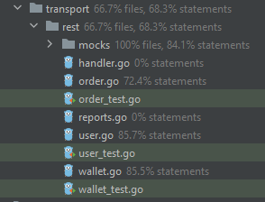

# Тестовое задание на стажировку Avito Tech Golang Backend Developer


[Описание задания](https://github.com/avito-tech/internship_backend_2022)

* Задача реализована с помощью фреймворка - Echo
* Выполнялось основываясь на принципах Чистой архитектуры (handler->service->repository)
* Database - PostgreSQL
* Postman файл с примерами запросов включен в репозиторий
* Конфигурационный env файл обрабатывается с помощью viper
* Сгенерирована swagger документация
* Для запуска используется docker-compose
* Созданы файлы тестов и моков для controller уровня (transport) с использованием go:generate and mockery (TODO: покрыть repository).

Покрытие тестами:




### Запуск

Для запуска необходимо создать локальный app.env @ ./configs/app.env файл и затем выполнить в терминале:

```bash
make run
```

или

```bash
docker compose --env-file .\configs\app.env up --build wallet-app
```

_____________________________________________________________

# Реализовано:

1) Создание пользователя сервиса

`POST /v1/user/`
```json
{
   "firstName": "Kirill",
   "lastName": "Kot",
   "email": "kirill@gmail.com"
}
```
response:
```json
{
    "id": "893035fc-a9ef-4a9b-8b5d-51e899198013",
    "firstName": "Kirill",
    "lastName": "Kot",
    "email": "kirill@gmail.com"
}
```
_____________________________________________________________
2) Метод начисления средств на баланс.

Возможно начисление по 1 из параметров - id_user, email, id_wallet

`PUT /v1/user/wallet/deposit`
```json
{
    "id_user": "893035fc-a9ef-4a9b-8b5d-51e899198013",
    "amount": 555
}
```
response:
```json
{
    "message": "Deposited 555 to dd321dddsd@gmail.com. Balance: 555"
}
```
_____________________________________________________________
3) Метод получения баланса по id пользователя.

   `GET /v1/user/:id`
id = 893035fc-a9ef-4a9b-8b5d-51e899198013

response:
```json
{
    "balance": "555",
    "message": "Balance of kirill@gmail.com"
}
```
_____________________________________________________________
4) Метод перевод средств от пользователя к пользователю.

   `PUT /v1/user/wallet/transfer`
```json
{
   "from_id": "893035fc-a9ef-4a9b-8b5d-51e899198013",
   "to_id": "102b1ff4-d679-4511-8ef2-b8dc360a2b06",
   "amount": 44
}
```
response:
```json
{
   "message": "Transfered 44 to eugene@gmail.com"
}
```
_____________________________________________________________
5) Метод резервирования средств с основного баланса на отдельном счете:

Реализован как Метод оформления заказа напокупку услуги.

   `POST /v1/user/wallet/order/buy`
```json
{
   "id_user": "893035fc-a9ef-4a9b-8b5d-51e899198013",
   "service_name": "Dodo Pizza",
   "cost": 22
}
```
response:
```json
{
   "message": "Created order for Dodo Pizza for 22",
   "order_id": "7fe842c5-94c8-4bb0-92bd-3f881cac4f34"
}
```
_____________________________________________________________
6) Метод признания выручки - реализован как <br>
   5.1) метод подтверждения заказа на покупку услуги <br>

   `POST /v1/user/wallet/order/approve`
```json
{
   "id_user": "893035fc-a9ef-4a9b-8b5d-51e899198013",
   "id_order": "7fe842c5-94c8-4bb0-92bd-3f881cac4f34"
}
```
response:
```json
{
   "message": "Order completed"
}
```
   5.2) отклонения заказа (и возвращение средств на основной баланс кошелька пользователя - разрезервирование средств
   пользователя).

   `POST /v1/user/wallet/order/decline`
```json
{
   "id_user": "893035fc-a9ef-4a9b-8b5d-51e899198013",
   "id_order": "076c3ebd-820e-4f33-8bbf-d63af28d8174"
}
```
response:
```json
{
   "message": "Order completed"
}
```
_____________________________________________________________
Дополнительные задания:

1) Метод получения отчета для бухгалетрии.
 
В учет берется только успешно завершенные заказы (подтвержденные) с комментариям "income...".

   `POST /v1/user/wallet/order/report`
```json
{
   "year": 2022,
   "month": 11
}
```
response:
```json
{
   "message": "Report for 11 2022",
   "report": [
      {
         "Amount": 44,
         "Text": "income from Dodo Pizza"
      },
      {
         "Amount": 245,
         "Text": "income from Yandex Taxi"
      }
   ]
}
```
   - TODO: Реализовать выдачу csv-файла в виде ссылки (s3)
_____________________________________________________________
2) Реализован метод получения списка транзакций пользователя по его id

Параметры сортировки и пагинации указываются в запросе

   `POST /v1/user/data`
```json
{
   "user_id": "afda1a6f-01bc-46a8-97d1-39efd0a72c2d",
   "limit": 3,
   "offset": 2,
   "order": "DESC",
   "sort_field": "amount"
}
```
response:
```json
{
   "message": "Report for afda1a6f-01bc-46a8-97d1-39efd0a72c2d",
   "report": [
      {
         "Date": "2022-11-06T20:26:04.072342Z",
         "Commentary": "Deposit",
         "Amount": 56111
      },
      {
         "Date": "2022-11-06T20:25:25.191993Z",
         "Commentary": "Deposit",
         "Amount": 5611
      },
      {
         "Date": "2022-11-06T14:38:45.846102Z",
         "Commentary": "Deposit",
         "Amount": 777
      }
   ]
}
```

# SWAGGER

Swagger docs
Чтобы обновить документацию используем: swag init -g cmd/server/main.go

Доступен по адресу: http://localhost:8080/swagger/index.html

Пример реализации


# Вопросы и решения:

1) По умолчанию сервис не содержит в себе никаких данных о балансах (пустая табличка в БД). Данные о балансе появляются
   при первом зачислении денег.
    - При создании пользователя сервиса у него нет кошелька, кошелек создается при первом зачислении денег на счет -
      создается кошелек с 0 балансом и следующим запросом баланс пополняется на указанную сумму.
    - Можно оптимизировать - делать все сразу в 1 запросе, но пока оставил такую реализацию, т.к. пользователь может
      зарегистрироваться, но не пользоваться услугами, т.е. не иметь кошелька.
2) Во всех методах, которые идентифицируют пользователей, оставил только ид пользователя, кроме метода начисления
   средств, с целью уменьшения количества кода, но реализация показана :)
3) В идеале для метода "3) перевод средст между пользователями" нужна авторизация у того, кто переводит деньги, но в
   задании
   не было указано, что нужна авторизация, поэтому принял, что приходят запросы из другой системы, где пользователь уже
   авторизован и мы выполняем запросы от его имени.
4) Есть следующая формулировка "Для этого у нас есть специальный сервис управления услугами, который перед применением
   услуги резервирует деньги на отдельном счете и потом списывает в доход компании."
    - Сделал так, что при оформлении заказа на покупку услуги, средства переносятся с баланса на "удерживаемые" средства
      кошелька пользователя до того момента, пока не будет закрыт заказ (успех - списываются и переводятся продавцу,
      отказ -
      возвращаются пользователю).
5) Для доп.задания с отчетом решил, что не стоит делать отдельной таблицы и достаточно таблицы с транзакциями и
   фильтрацией по комментариям транзакций. Все транзакции с комментарием "income from..." - это получение прибыли с
   продажи услуг, т.е. можно их просто просуммировать.
6) Заранее предопределил 3 услуги, метод добавления новых услуг не реализовывал.
